# FootballHub

FootballHub is een webapplicatie voor voetballiefhebbers en recreatieve spelers.
Gebruikers kunnen voetbalclubs, spelers en stadions ontdekken, en ingelogde gebruikers kunnen stadions reserveren.
Admins kunnen daarnaast clubs, spelers, stadions en reservaties beheren via een beveiligde beheeromgeving.

---

## Inhoud

* [Productvisie](#productvisie)
* [Productbeschrijving](#productbeschrijving)
* [User Story Map](#user-story-map)
* [Persona's](#personas)
* [Conceptueel model](#conceptueel-model)
* [Functionele analyse](#functionele-analyse)
* [Wireframes](#wireframes)
* [Use Case Diagrammen](#use-case-diagrammen)
* [Activity Diagrammen](#activity-diagrammen)
* [Sequence Diagram](#sequence-diagram)
* [Class Diagram](#class-diagram)
* [State Transition Diagram](#state-transition-diagram)
* [Besluit](#besluit)

---

# Productvisie

FootballHub wil een centraal platform zijn waar gebruikers eenvoudig informatie kunnen vinden over voetbalclubs, spelers en stadions, én waar ze op een gebruiksvriendelijke manier een stadium kunnen reserveren.

De applicatie combineert twee doelen:

* **informatie aanbieden** over voetbalgerelateerde entiteiten (clubs, spelers, stadions)
* **praktische functionaliteit bieden** via een reservatiesysteem voor stadions

Voor admins biedt FootballHub daarnaast een eenvoudige beheeromgeving om alle data en reservaties centraal te beheren.

---

# Productbeschrijving

## Wat?

FootballHub is een webapplicatie waarin gebruikers:

* voetbalclubs kunnen bekijken
* spelers kunnen bekijken en filteren
* stadions kunnen bekijken
* details van clubs, spelers en stadions kunnen raadplegen
* een stadium kunnen reserveren (na inloggen)

Admins kunnen daarnaast:

* clubs aanmaken, aanpassen en verwijderen
* spelers aanmaken, aanpassen en verwijderen
* stadions aanmaken, aanpassen en verwijderen
* alle reservaties bekijken
* reservaties verwijderen

## Voor wie?

FootballHub is bedoeld voor:

* **recreatieve voetballers** of vriendengroepen die een stadium willen huren
* **voetbalfans** die informatie willen bekijken over clubs en spelers
* **admins / beheerders** die de inhoud van het platform en de reservaties beheren

## Waarom?

FootballHub centraliseert informatie en reservaties in één platform.

### Voordelen voor gebruikers

* snel clubs, spelers en stadions terugvinden
* een stadium online reserveren zonder manuele communicatie
* overzicht van eigen reservaties
* duidelijke foutmeldingen bij ongeldige of conflicterende reservaties

### Voordelen voor admins

* centrale administratie van clubs, spelers en stadions
* overzicht van alle reservaties
* minder fouten dankzij validaties en business rules

### Voordeel voor het project

* duidelijke rollenstructuur
* logische domeinrelaties
* realistische business flow via reservaties
* geschikt als analyse- en ontwikkelproject

---

# User Story Map

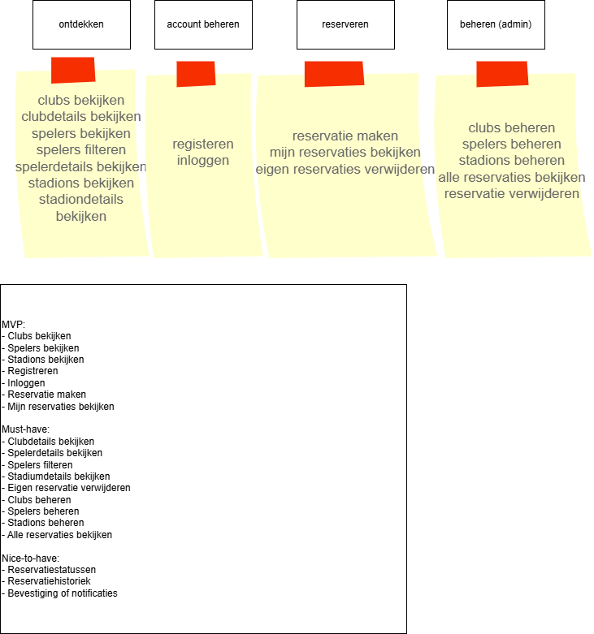

## Backbone

De User Story Map van FootballHub is opgebouwd rond vier hoofdactiviteiten:

* **Ontdekken**
* **Account beheren**
* **Reserveren**
* **Beheren (admin)**

## User stories per activiteit

### Ontdekken

* Als gast wil ik clubs bekijken zodat ik informatie over voetbalclubs kan ontdekken.
* Als gast wil ik clubdetails bekijken zodat ik meer informatie krijg over een club.
* Als gast wil ik spelers bekijken zodat ik spelers kan ontdekken.
* Als gast wil ik spelers kunnen filteren zodat ik sneller relevante spelers vind.
* Als gast wil ik spelerdetails bekijken zodat ik meer informatie krijg over een speler.
* Als gast wil ik stadions bekijken zodat ik een geschikt stadium kan kiezen.
* Als gast wil ik stadiumdetails bekijken zodat ik prijs, capaciteit en beschrijving kan zien.

### Account beheren

* Als bezoeker wil ik me kunnen registreren zodat ik reservaties kan maken.
* Als gebruiker wil ik kunnen inloggen zodat ik toegang krijg tot mijn reservaties.
* Als gebruiker wil ik kunnen uitloggen zodat mijn account veilig blijft.

### Reserveren

* Als gebruiker wil ik een stadium kunnen kiezen zodat ik een reservatie kan maken.
* Als gebruiker wil ik een datum, startuur en duur kunnen kiezen zodat ik mijn reservatie kan plannen.
* Als gebruiker wil ik geen overlappende reservatie kunnen maken zodat dubbele boekingen vermeden worden.
* Als gebruiker wil ik mijn reservaties kunnen bekijken zodat ik overzicht heb.
* Als gebruiker wil ik mijn reservatie kunnen verwijderen zodat ik flexibel blijf.

### Beheren (admin)

* Als admin wil ik clubs kunnen beheren zodat de clubinformatie correct blijft.
* Als admin wil ik spelers kunnen beheren zodat de spelersinformatie actueel blijft.
* Als admin wil ik stadions kunnen beheren zodat reservaties op correcte data gebaseerd zijn.
* Als admin wil ik alle reservaties kunnen bekijken zodat ik overzicht en controle heb.
* Als admin wil ik reservaties kunnen verwijderen indien nodig.

## Slices

### MVP

* clubs bekijken
* spelers bekijken
* stadions bekijken
* registreren
* inloggen
* reservatie maken
* mijn reservaties bekijken

### Must-have

* clubdetails bekijken
* spelerdetails bekijken
* spelers filteren
* stadiumdetails bekijken
* eigen reservatie verwijderen
* clubs beheren
* spelers beheren
* stadions beheren
* alle reservaties bekijken

### Nice-to-have

* reservatiestatussen
* reservatiehistoriek
* bevestigingen of notificaties

---

# Persona's

## Persona 1 – Milan (recreatieve speler)

**Leeftijd:** 22 jaar
**Profiel:** Student die wekelijks met vrienden voetbal speelt.
**Doel:** Snel en eenvoudig een stadium reserveren voor een voetbalavond.

### Behoeften

* een duidelijke reservatiepagina
* eenvoudig stadium kiezen
* foutmeldingen wanneer een reservatie niet mogelijk is
* overzicht van eigen reservaties

### Pijnpunten

* manueel reserveren via berichten of telefoon kost tijd
* onduidelijkheid over beschikbaarheid zorgt voor frustratie

---

## Persona 2 – Sarah (voetbalfan)

**Leeftijd:** 28 jaar
**Profiel:** Voetbalfan die graag informatie opzoekt over clubs en spelers.
**Doel:** Clubs, spelers en stadions op één overzichtelijke plaats kunnen bekijken.

### Behoeften

* duidelijke lijsten
* filters om spelers sneller terug te vinden
* detailpagina’s met relevante informatie

### Pijnpunten

* informatie staat vaak verspreid over verschillende websites
* het kost tijd om alles te vergelijken

---

## Persona 3 – Tom (admin)

**Leeftijd:** 35 jaar
**Profiel:** Beheerder van het platform.
**Doel:** Clubs, spelers, stadions en reservaties efficiënt beheren via één centrale applicatie.

### Behoeften

* eenvoudige beheerformulieren
* duidelijke CRUD-functionaliteit
* overzicht van alle reservaties
* controle over foutieve of verouderde data

### Pijnpunten

* manuele administratie kost veel tijd
* foutieve data leidt tot verwarring
* zonder systeem is opvolging moeilijker

---

# Conceptueel model

## Belangrijkste concepten

### Club

Een voetbalclub met basisinformatie zoals naam, stad, stadion en oprichtingsjaar.

### Player

Een speler met naam, positie, leeftijd, nationaliteit en een gekoppelde club.

### Stadium

Een stadium dat gereserveerd kan worden. Bevat naam, stad, capaciteit, prijs per uur, beschrijving en afbeelding.

### Reservation

Een reservatie van een stadium door een gebruiker op een bepaalde datum en tijd, met een duur en een automatisch berekende totale prijs.

### SiteUser

Een geregistreerde gebruiker van het systeem met een gebruikersnaam, wachtwoord en rol (`ROLE_USER` of `ROLE_ADMIN`).

## Relaties

* Een **Club** heeft meerdere **Players**
* Een **Player** behoort tot exact één **Club**
* Een **SiteUser** heeft meerdere **Reservations**
* Een **Reservation** behoort tot exact één **SiteUser**
* Een **Stadium** heeft meerdere **Reservations**
* Een **Reservation** behoort tot exact één **Stadium**

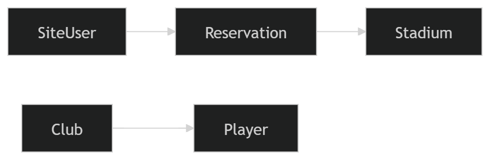

---

# Functionele analyse

## 1. Authenticatie

De applicatie ondersteunt gebruikersregistratie en login via Spring Security.

### Functionaliteiten

* registreren
* inloggen via een custom loginpagina
* uitloggen
* rollen bepalen welke pagina’s toegankelijk zijn

### Rollen

* **Gast**
* **Geregistreerde gebruiker (`ROLE_USER`)**
* **Admin (`ROLE_ADMIN`)**

---

## 2. Publieke informatie

Niet-ingelogde bezoekers kunnen de informatieve onderdelen van de website gebruiken.

### Clubs

* clublijst bekijken
* filteren op zoekwoord
* filteren op minimum oprichtingsjaar
* clubdetails bekijken
* navigeren naar vorige / volgende club

### Players

* spelerslijst bekijken
* filteren op:

  * zoekwoord
  * club
  * positie
  * minimum leeftijd
  * maximum leeftijd
* spelerdetails bekijken
* navigeren naar vorige / volgende speler

### Stadiums

* stadiumlijst bekijken
* stadiumdetails bekijken
* navigeren naar vorige / volgende stadium

---

## 3. Reservaties

Een ingelogde gebruiker kan een stadium reserveren.

### Reservatieformulier

De pagina **Stadium reserveren** bevat:

* gebruiker (readonly veld)
* stadiumselectie via dropdown
* datum
* startuur
* duur in uren
* knop **Reservatie opslaan**
* knop **Annuleren**

### Validaties

Het systeem controleert:

* stadium is geselecteerd
* datum is ingevuld
* startuur is ingevuld
* startuur ligt tussen **8 en 22**
* duur is ingevuld
* duur ligt tussen **1 en 8 uur**
* einduur mag niet later zijn dan **23 uur**
* er mag **geen overlap** zijn met bestaande reservaties voor hetzelfde stadium op dezelfde datum

### Business rules

* De totale prijs wordt automatisch berekend:

  * `prijsPerUur × duur`
* Bij conflict verschijnt een duidelijke foutmelding
* Bij succes wordt de gebruiker doorgestuurd naar **Mijn reservaties**

### Reservatiebeheer voor gebruiker

* mijn reservaties bekijken
* eigen reservaties verwijderen

---

## 4. Admin beheer

Een admin heeft toegang tot beheerfunctionaliteiten.

### Clubbeheer

* club aanmaken
* club aanpassen
* club verwijderen

**Extra regel:**
Een club kan niet verwijderd worden als er nog spelers aan gekoppeld zijn.

### Playerbeheer

* speler aanmaken
* speler aanpassen
* speler verwijderen

### Stadiumbeheer

* stadium aanmaken
* stadium aanpassen
* stadium verwijderen

### Reservatiebeheer

* alle reservaties bekijken
* reservaties verwijderen

---

## 5. Afbeeldingen uploaden

Bij clubs, spelers en stadions kunnen afbeeldingen geüpload worden.

### Validaties

* afbeelding is verplicht bij create
* toegelaten bestandstypes:

  * `.jpg`
  * `.jpeg`
  * `.png`
  * `.webp`

### Opslag

De afbeelding wordt opgeslagen in:

* `src/main/resources/static/img`

---

# Wireframes

## Wireframe 1 – Homepagina

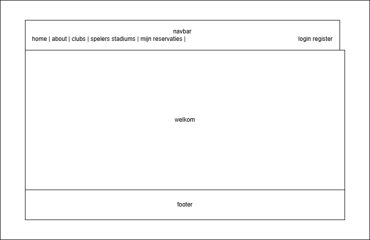

### Korte uitleg

De homepagina is bewust eenvoudig opgebouwd.
Ze bevat een navigatiebalk, een centrale welkomstsectie en een footer.
Dit scherm dient als startpunt van de applicatie en leidt gebruikers naar de belangrijkste onderdelen van FootballHub.

---

## Wireframe 2 – Stadium reserveren

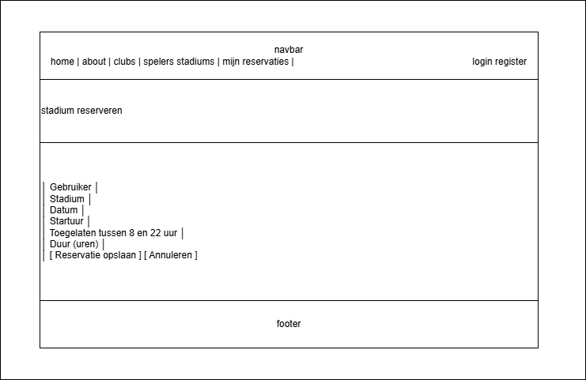

### Korte uitleg

De pagina **Stadium reserveren** bevat een formulier waarin een ingelogde gebruiker een stadium kan reserveren.
Het scherm toont duidelijk alle invoervelden, foutmeldingen en acties.
Dit is een belangrijk scherm omdat hier de kernfunctionaliteit van de applicatie plaatsvindt, inclusief validaties en conflictcontrole.

---

# Use Case Diagrammen

Omdat FootballHub meer dan 9 use cases bevat, zijn de use cases opgesplitst in twee logische diagrammen.

## Use Case Diagram 1 – Gast en gebruiker

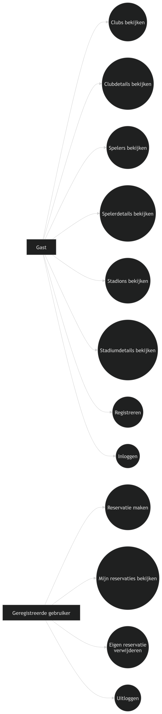

### Bevat onder andere

* clubs bekijken
* clubdetails bekijken
* spelers bekijken
* spelerdetails bekijken
* stadions bekijken
* stadiumdetails bekijken
* registreren
* inloggen
* reservatie maken
* mijn reservaties bekijken
* eigen reservatie verwijderen
* uitloggen

---

## Use Case Diagram 2 – Admin

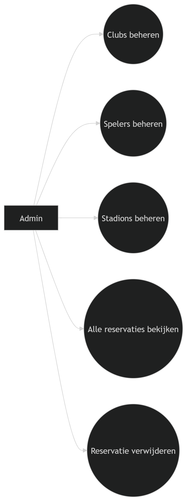

### Bevat onder andere

* clubs beheren
* spelers beheren
* stadions beheren
* alle reservaties bekijken
* reservaties verwijderen

---

# Activity Diagrammen

Voor de analyse zijn twee belangrijke en voldoende complexe flows uitgewerkt.

## Activity Diagram 1 – Reservatie maken

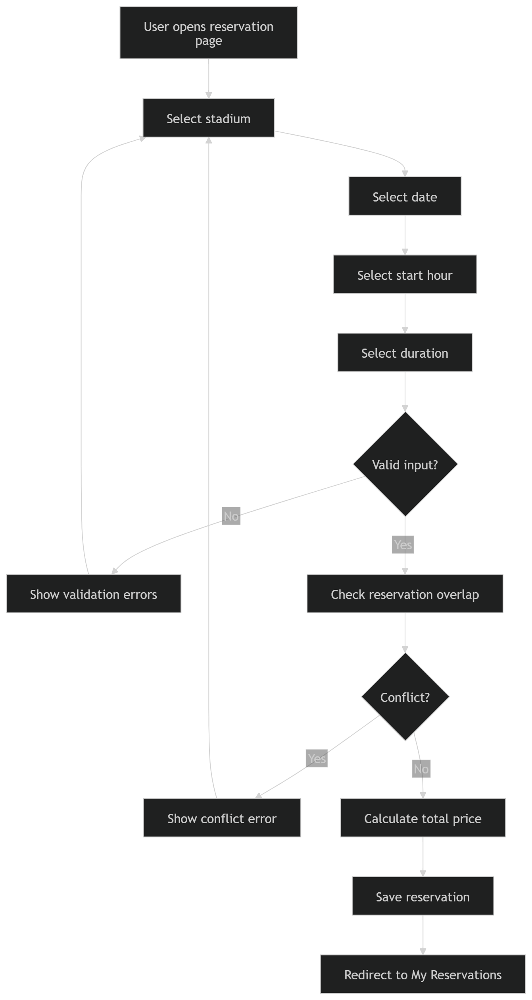

### Waarom deze flow?

Dit is de belangrijkste business flow van de applicatie.
Ze bevat meerdere validaties, een decision/merge en een conflictcontrole.

### Samenvatting

1. Gebruiker opent reservatieformulier
2. Gebruiker vult stadium, datum, startuur en duur in
3. Systeem valideert invoer
4. Systeem controleert overlap
5. Bij conflict: foutmelding
6. Zonder conflict: prijs berekenen en reservatie opslaan
7. Doorsturen naar **Mijn reservaties**

---

## Activity Diagram 2 – Admin beheert stadium

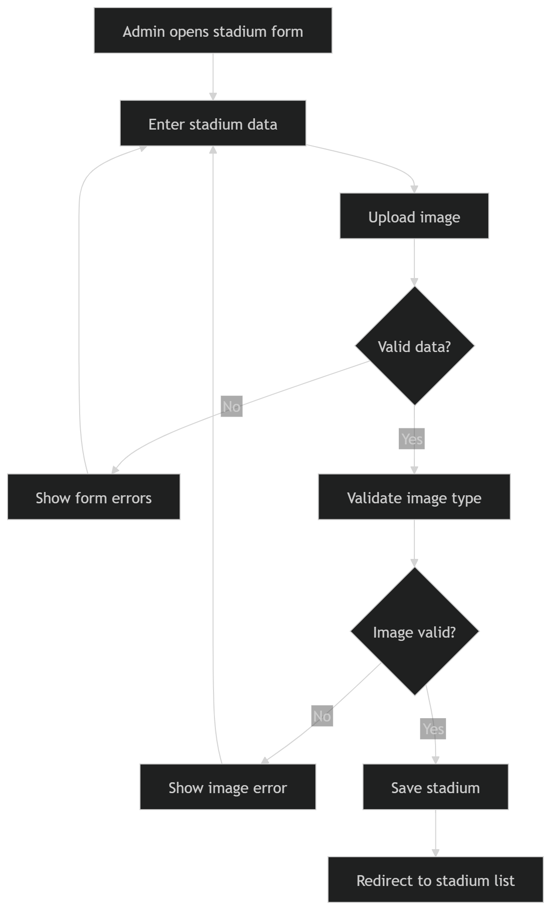

### Waarom deze flow?

Deze flow toont een typische adminbewerking met validatie en afbeeldingscontrole.

### Samenvatting

1. Admin opent create/edit formulier
2. Admin vult gegevens in
3. Admin uploadt eventueel een afbeelding
4. Systeem valideert formulier
5. Systeem valideert bestandstype
6. Bij fout: terug naar formulier
7. Bij succes: stadium opslaan

---

# Sequence Diagram

## Sequence Diagram – Reservatie maken

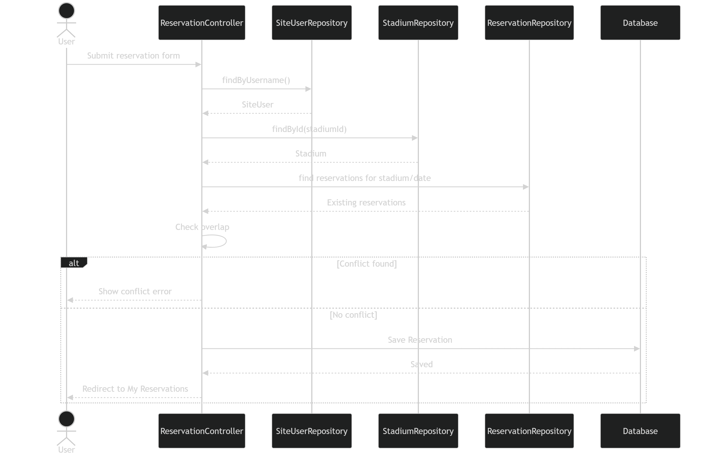

### Beschrijving

Dit sequence diagram toont hoe de verschillende onderdelen samenwerken wanneer een gebruiker een reservatie maakt.

### Betrokken componenten

* gebruiker
* `ReservationController`
* `SiteUserRepository`
* `StadiumRepository`
* `ReservationRepository`
* database

### Samenvatting

1. Gebruiker verstuurt reservatieformulier
2. Controller haalt ingelogde gebruiker op
3. Controller haalt stadium op
4. Controller haalt bestaande reservaties op voor dat stadium en die datum
5. Controller controleert overlap
6. Bij conflict: foutmelding
7. Bij succes: reservatie opslaan
8. Redirect naar **Mijn reservaties**

---

# Class Diagram

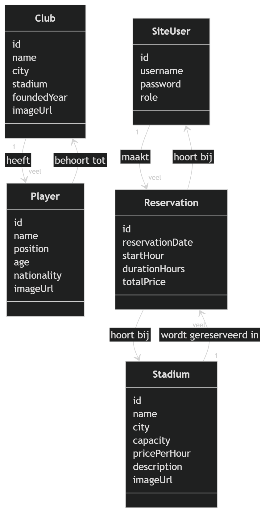

## Belangrijkste domeinklassen

* `SiteUser`
* `Club`
* `Player`
* `Stadium`
* `Reservation`

## Belangrijkste relaties

* `Club` **1 → veel** `Player`
* `SiteUser` **1 → veel** `Reservation`
* `Stadium` **1 → veel** `Reservation`

### Korte toelichting

#### SiteUser

Bevat:

* id
* username
* password
* role

#### Club

Bevat:

* id
* name
* city
* stadium
* foundedYear
* imageUrl

#### Player

Bevat:

* id
* name
* position
* age
* nationality
* imageUrl
* club

#### Stadium

Bevat:

* id
* name
* city
* capacity
* pricePerHour
* description
* imageUrl

#### Reservation

Bevat:

* id
* reservationDate
* startHour
* durationHours
* totalPrice
* siteUser
* stadium

---

# State Transition Diagram

## State Transition Diagram – Reservation

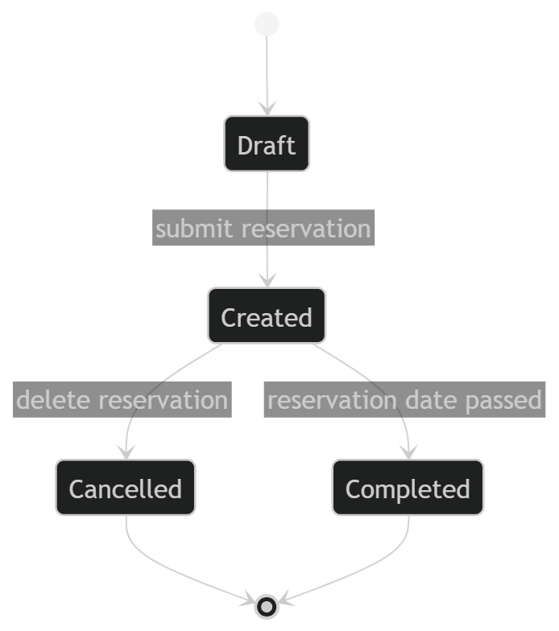

### Gekozen object

Voor het state diagram werd **Reservation** gekozen, omdat dit het meest logische object is dat van toestand verandert.

### Mogelijke statussen

* **Draft** → gebruiker vult het formulier in
* **Created** → reservatie werd succesvol opgeslagen
* **Cancelled** → reservatie werd verwijderd / geannuleerd
* **Completed** → reservatiedatum ligt in het verleden

### Opmerking

In de huidige code bestaat nog geen expliciete `status`-property in de `Reservation`-klasse.
Toch is dit state diagram zinvol als **conceptuele analyse**, omdat het toont hoe een reservatie zich logisch doorheen de levenscyclus van het systeem beweegt.

---

# Besluit

FootballHub is een webapplicatie met een duidelijke functionele scope en voldoende complexiteit voor deze analyse-opdracht.

Het project bevat:

* meerdere domeinobjecten
* duidelijke relaties tussen entiteiten
* verschillende gebruikersrollen
* CRUD-functionaliteiten
* authenticatie en autorisatie via Spring Security
* een realistische business flow via stadiumreservaties
* validaties en business rules, zoals overlapcontrole

Daardoor is FootballHub een geschikt project voor:

* productanalyse
* user story mapping
* persona’s
* wireframes
* use case modelling
* activity diagrams
* sequence diagram
* class diagram
* state transition diagram

Deze analyse toont niet alleen hoe de applicatie functioneert, maar ook hoe de structuur, gebruikersdoelen en workflows logisch opgebouwd zijn.
